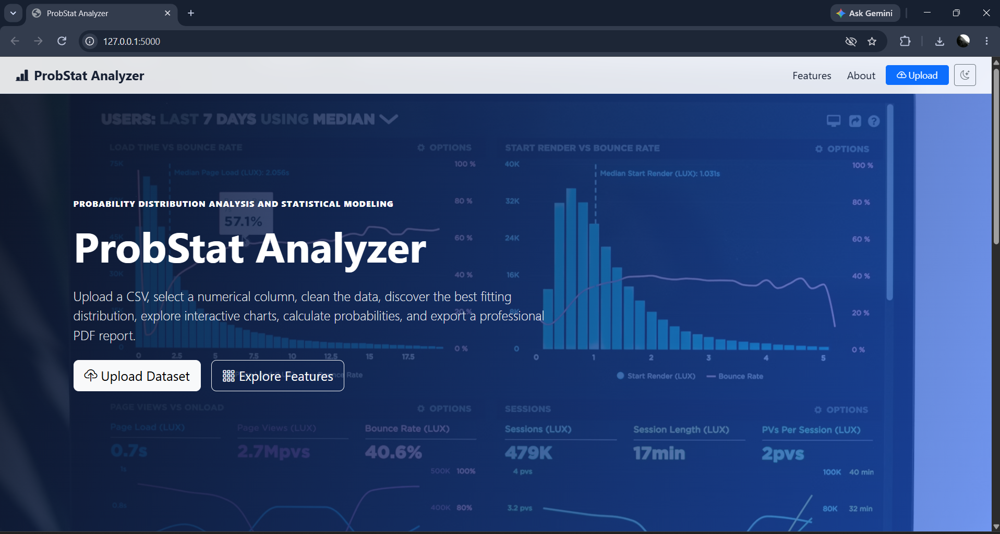
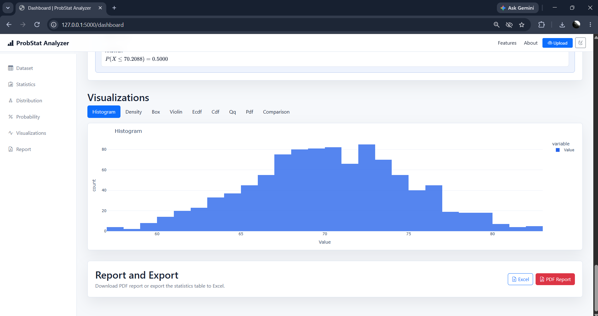

````markdown
# ProbStat Analyzer

## A Web-Based Probability Distribution Analysis and Statistical Modeling System

ProbStat Analyzer is a web-based statistical analysis system developed as a capstone project for **UBA5316 – Probabilistic Methods and Linear Algebra (PMLA)**.

The system analyzes numerical datasets, performs descriptive statistical analysis, classifies datasets as discrete or continuous, fits suitable probability distributions, evaluates goodness-of-fit, calculates probabilities, generates visualizations, and provides statistical interpretations.

---

## 📌 Project Overview

Probability distributions are widely used to model uncertainty and random phenomena in engineering, science, healthcare, finance, manufacturing, and data analysis.

Selecting an appropriate probability distribution manually can be difficult, especially when dealing with large numerical datasets.

**ProbStat Analyzer** provides an automated statistical workflow that allows users to upload a dataset and obtain a complete probability distribution analysis.

### The system:

- Accepts CSV datasets
- Performs data preprocessing
- Extracts numerical observations
- Calculates descriptive statistics
- Classifies data as discrete or continuous
- Fits suitable probability distributions
- Estimates distribution parameters
- Calculates goodness-of-fit measures
- Compares candidate distributions
- Identifies the best-fitting distribution
- Calculates probabilities
- Generates statistical visualizations
- Provides distribution explanations
- Supports statistical report generation

---

# 🎯 Objectives

The main objectives of ProbStat Analyzer are:

1. Analyze numerical datasets using probability and statistical methods.
2. Classify datasets into discrete and continuous random variables.
3. Calculate descriptive statistics.
4. Estimate parameters for probability distributions.
5. Fit suitable probability distributions to observed data.
6. Compare distributions using goodness-of-fit measures.
7. Identify the distribution that best represents the dataset.
8. Calculate probabilities for selected events.
9. Generate graphical representations of the observed and fitted distributions.
10. Provide understandable statistical interpretations of the results.

---

# 📊 Supported Probability Distributions

The system supports six probability distributions.

## Continuous Distributions

| Distribution | Function | Parameters |
|---|---|---|
| Normal | PDF | Mean (μ), Standard Deviation (σ) |
| Uniform | PDF | Minimum (a), Maximum (b) |
| Exponential | PDF | Rate (λ) |

## Discrete Distributions

| Distribution | Function | Parameters |
|---|---|---|
| Binomial | PMF | n, p |
| Poisson | PMF | λ |
| Geometric | PMF | p |

---

# 🧮 Mathematical Foundation

## 1. Normal Distribution

The Normal probability density function is:

\[
f(x)=\frac{1}{\sigma\sqrt{2\pi}}
e^{-\frac{(x-\mu)^2}{2\sigma^2}}
\]

Mean:

\[
E(X)=\mu
\]

Variance:

\[
Var(X)=\sigma^2
\]

---

## 2. Uniform Distribution

\[
f(x)=\frac{1}{b-a}, \quad a\leq x\leq b
\]

Mean:

\[
E(X)=\frac{a+b}{2}
\]

Variance:

\[
Var(X)=\frac{(b-a)^2}{12}
\]

---

## 3. Exponential Distribution

\[
f(x)=\lambda e^{-\lambda x}, \quad x\geq0
\]

Mean:

\[
E(X)=\frac{1}{\lambda}
\]

Variance:

\[
Var(X)=\frac{1}{\lambda^2}
\]

The rate parameter is estimated from the sample mean:

\[
\hat{\lambda}=\frac{1}{\bar{x}}
\]

---

## 4. Poisson Distribution

\[
P(X=x)=\frac{e^{-\lambda}\lambda^x}{x!}
\]

Mean:

\[
E(X)=\lambda
\]

Variance:

\[
Var(X)=\lambda
\]

---

## 5. Binomial Distribution

\[
P(X=x)=
\binom{n}{x}p^x(1-p)^{n-x}
\]

Mean:

\[
E(X)=np
\]

Variance:

\[
Var(X)=np(1-p)
\]

---

## 6. Geometric Distribution

The project uses the convention where \(X\) represents the number of trials until the first success.

\[
P(X=x)=p(1-p)^{x-1}
\]

Mean:

\[
E(X)=\frac{1}{p}
\]

Variance:

\[
Var(X)=\frac{1-p}{p^2}
\]

---

# 🔬 Goodness-of-Fit Analysis

ProbStat Analyzer does not select a distribution simply by looking at the graph.

The system statistically evaluates each suitable candidate distribution using:

- Kolmogorov-Smirnov (KS) Statistic
- Akaike Information Criterion (AIC)
- Bayesian Information Criterion (BIC)

## Kolmogorov-Smirnov Statistic

The KS statistic measures the maximum difference between the empirical distribution and the fitted theoretical distribution.

\[
D=\max|F_n(x)-F(x)|
\]

A lower KS value indicates that the fitted distribution is closer to the observed data.

For discrete distributions, a discrete KS calculation is used to account for the stepwise nature of discrete probability distributions.

## Akaike Information Criterion

\[
AIC=2k-2\ln(L)
\]

where:

- \(k\) = number of model parameters
- \(L\) = likelihood of the observed data

Lower AIC indicates a better model according to the AIC criterion.

## Bayesian Information Criterion

\[
BIC=k\ln(n)-2\ln(L)
\]

where:

- \(k\) = number of parameters
- \(n\) = number of observations
- \(L\) = likelihood

Lower BIC indicates a better model according to the BIC criterion.

---

# 🔄 Distribution Selection Process

The analyzer independently determines which probability distribution best represents the uploaded dataset.

```text
CSV Dataset
     ↓
Data Preprocessing
     ↓
Numerical Data Extraction
     ↓
Discrete / Continuous Classification
     ↓
Suitable Candidate Distributions
     ↓
Parameter Estimation
     ↓
Distribution Fitting
     ↓
KS + AIC + BIC
     ↓
Distribution Comparison
     ↓
Best-Fitting Distribution
     ↓
Probability Calculation
     ↓
Visualization & Report
````

The original distribution is not provided to the analyzer.

For example, if a dataset was generated using a Poisson distribution with a known λ, the analyzer receives only the numerical observations. It estimates λ from the observed data and independently evaluates whether Poisson provides the best fit.

---

# 📈 Visualization

The visualizations are generated directly from the numerical dataset and the fitted probability distribution.

## Continuous Distributions

For Normal, Uniform and Exponential distributions:

1. Numerical observations are extracted.
2. A histogram represents the observed data.
3. Distribution parameters are estimated.
4. The theoretical PDF is calculated.
5. The fitted PDF is plotted along with the observed data.

## Discrete Distributions

For Binomial, Poisson and Geometric distributions:

1. Integer observations are analyzed.
2. Frequencies are calculated.
3. Distribution parameters are estimated.
4. The theoretical PMF is calculated.
5. The fitted PMF is compared with the observed frequencies.

---

# 📊 Statistical Analysis

The system provides several descriptive statistical measures:

* Number of observations
* Mean
* Median
* Mode
* Variance
* Standard Deviation
* Minimum
* Maximum
* Range
* Quartiles
* Skewness
* Kurtosis

The system also provides:

* Distribution parameters
* KS statistic
* AIC
* BIC
* Distribution ranking
* Selected distribution
* Probability results

---

# 🧠 How the System Analyzes a Dataset

The complete analysis follows these steps.

### Step 1 — Dataset Upload

The user uploads a CSV file containing numerical observations.

### Step 2 — Data Preprocessing

The system checks and prepares the numerical data for statistical analysis.

### Step 3 — Descriptive Statistics

The system calculates:

```text
Mean
Median
Mode
Variance
Standard Deviation
```

along with other statistical measures.

### Step 4 — Data Classification

The dataset is classified as:

* Continuous
* Discrete

Continuous distributions are compared only with:

* Normal
* Uniform
* Exponential

Discrete distributions are compared only with:

* Binomial
* Poisson
* Geometric

### Step 5 — Parameter Estimation

Parameters are estimated from the observed numerical data.

### Step 6 — Distribution Fitting

Each suitable distribution is fitted to the dataset.

### Step 7 — Goodness-of-Fit

The fitted models are evaluated using:

* KS
* AIC
* BIC

### Step 8 — Distribution Selection

The candidate distributions are compared and the best-fitting distribution is selected.

### Step 9 — Probability Analysis

The selected distribution is used to calculate required probability values.

### Step 10 — Visualization

The actual dataset and fitted probability model are visualized.

---

# 🖥️ Application Screenshots

## 1. Home Page

The home page provides the main interface for accessing the dataset analysis features.



---

## 2. File Upload

Users can upload a CSV dataset for analysis.


---

## 3. Dataset Analysis

The system analyzes the uploaded numerical dataset and presents the initial analysis.


---

## 4. Descriptive Statistics

The system calculates important statistical measures such as mean, median, variance, standard deviation, minimum, maximum, skewness and kurtosis.


---

## 5. Distribution Explanation

The application provides mathematical and statistical information about the distributions being analyzed.


---

## 6. Distribution Selection

The system compares the suitable probability distributions using goodness-of-fit measures and identifies the best-fitting distribution.


---

## 7. Graphical Visualization

The system generates graphs using the numerical observations and the fitted probability distribution.



---

## 8. Probability Calculator

The probability calculator allows users to calculate probability values for the selected distribution.


---

# 🧰 Technology Stack

## Programming Language

* Python

## Backend

* Flask

## Data Processing

* Pandas
* NumPy

## Statistical Computing

* SciPy

## Visualization

* Matplotlib
* Plotly

## Frontend

* HTML
* CSS
* JavaScript
* Bootstrap

## Report Generation

* ReportLab
* OpenPyXL

## Client-Server Communication

* AJAX
* Fetch API

---

# 📁 Project Structure

```text
ProbStatAnalyzer/
│
├── app.py
│
├── models/
│   └── distributions.py
│
├── templates/
│   ├── index.html
│   └── ...
│
├── static/
│   ├── css/
│   ├── js/
│   └── ...
│
├── requirements.txt
├── README.md
└── .gitignore
```

Sample datasets are maintained in the repository's `datasets` directory.

---

# ⚙️ Installation

## 1. Clone the Repository

```bash
git clone https://github.com/Deepak-3357/probstat-analyzer.git
```

## 2. Navigate to the Project

```bash
cd probstat-analyzer/ProbStatAnalyzer
```

## 3. Create a Virtual Environment

```bash
python -m venv venv
```

## 4. Activate the Virtual Environment

### Windows

```bash
venv\Scripts\activate
```

### Linux / macOS

```bash
source venv/bin/activate
```

## 5. Install Dependencies

```bash
pip install -r requirements.txt
```

## 6. Run the Application

```bash
python app.py
```

## 7. Open in Browser

```text
http://127.0.0.1:5000
```

---

# 📦 Requirements

The project uses the following Python libraries:

```text
Flask
Pandas
NumPy
SciPy
Plotly
Matplotlib
ReportLab
OpenPyXL
```

---

# 🧪 Dataset Testing

The project can be tested using datasets representing all six supported probability distributions:

* Normal
* Uniform
* Exponential
* Poisson
* Binomial
* Geometric

A separate dataset generator was used to create synthetic test datasets using the mathematical parameters of each distribution.

The analyzer does not directly receive the original distribution information. It independently analyzes the numerical observations and determines the best-fitting distribution.

---

# 👥 Project Module Division

## Module 1 — Normal & Geometric Distribution Analysis

**Member:** Deepak

Responsibilities:

* Normal distribution
* Geometric distribution
* Parameter estimation
* Probability calculations
* Distribution fitting
* Goodness-of-fit analysis

## Module 2 — Uniform & Poisson Distribution Analysis

**Member:** Tamil

Responsibilities:

* Uniform distribution
* Poisson distribution
* Parameter estimation
* Probability calculations
* Distribution fitting
* Goodness-of-fit analysis

## Module 3 — Exponential & Binomial Distribution Analysis

**Member:** Ibram

Responsibilities:

* Exponential distribution
* Binomial distribution
* Parameter estimation
* Probability calculations
* Distribution fitting
* Goodness-of-fit analysis

---

# 🎓 Academic Relevance

The project demonstrates the practical implementation of concepts from **Probabilistic Methods and Linear Algebra**, including:

* Random Variables
* Discrete Probability Distributions
* Continuous Probability Distributions
* Probability Mass Functions (PMF)
* Probability Density Functions (PDF)
* Mean
* Median
* Mode
* Variance
* Standard Deviation
* Parameter Estimation
* Probability Calculation
* Statistical Modeling
* Goodness-of-Fit
* Data Visualization

---

# 🌍 Applications

ProbStat Analyzer can be applied to:

* Engineering Data Analysis
* Quality Control
* Reliability Engineering
* Healthcare Statistics
* Financial Risk Analysis
* Weather and Climate Analysis
* Manufacturing Process Monitoring
* Communication and Network Traffic Analysis
* Scientific Research
* Probability and Statistics Education

---

# 🚀 Future Scope

Future enhancements may include:

* Gamma Distribution
* Weibull Distribution
* Beta Distribution
* Log-Normal Distribution
* Advanced goodness-of-fit tests
* Hypothesis Testing
* Regression Analysis
* Multivariate Probability Distributions
* Real-time Data Analysis
* Automated Distribution Recommendation using Machine Learning
* Extended Probability Education Modules

---

# 🎯 Project Outcome

ProbStat Analyzer successfully integrates probability theory and statistical analysis into a single web-based system.

The system can analyze numerical datasets, classify random variables, estimate distribution parameters, compare probability distributions using KS, AIC and BIC, identify the best-fitting distribution, calculate probabilities, and generate meaningful statistical visualizations.

The project demonstrates how mathematical probability concepts can be applied to practical data analysis problems.

---

# 📜 License

This project is licensed under the **MIT License**.

---

# 👨‍💻 Author

**Deepak R**

Computer Science and Engineering Student

GitHub: [Deepak-3357](https://github.com/Deepak-3357)

```
```
